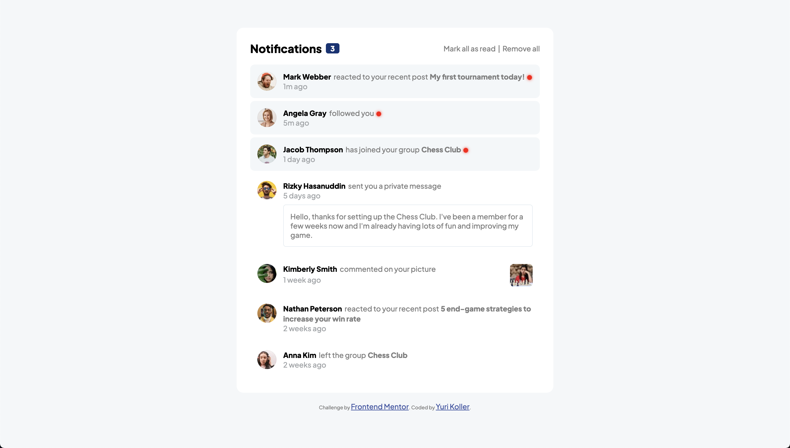

# Frontend Mentor - Notifications page solution

This is my solution to the [Notifications page challenge on Frontend Mentor](https://www.frontendmentor.io/challenges/notifications-page-DqK5QAmKbC). Frontend Mentor challenges help you improve your coding skills by building realistic projects.

## Table of contents

- [Overview](#overview)
  - [The challenge](#the-challenge)
  - [Screenshot](#screenshot)
  - [Links](#links)
- [My process](#my-process)
  - [Built with](#built-with)
  - [What I learned](#what-i-learned)
  - [Continued development](#continued-development)
- [Author](#author)
- [Acknowledgments](#acknowledgments)

## Overview

### The challenge

Users should be able to:

- Distinguish between "unread" and "read" notifications
- Select "Mark all as read" to toggle the visual state of the unread notifications and set the number of unread messages to zero
- View the optimal layout for the interface depending on their device's screen size
- See hover and focus states for all interactive elements on the page

Extra features:

- Select "remove all" to remove all notifications
- Hover over each notification to reveal a button on the right
- Click the button on the right to reveal a dropdown menu
- Click "Mark As Read" to mark a notification as read individually or "Mark As Unread' to mark a notification as unread individually
- Click "Remove Notification" to remove a notification from the list of notifications individually

### Screenshot



### Links

- Solution URL: [GitHub Solution](https://github.com/rnsnceman/notification-component)
- Live Site URL: [GitHub Live Site](https://rnsnceman.github.io/notification-component/)

## My process

### Built with

- Semantic HTML5 markup
- CSS custom properties
- Flexbox
- CSS Grid
- Mobile-first workflow

### What I learned

This was my first time using grid, which i used within the notification containers.

```css
.n-left {
  display: grid;
  grid-template-areas:
    "avatar info info"
    "avatar date date"
    ". msg msg";
  justify-content: flex-start;
}
```

### Continued development

I hope to continue to expand my knowledge in using javascript.

## Author

- Frontend Mentor - [@rnsnceman](https://www.frontendmentor.io/profile/rnsnceman)
- Instagram - [@yurikoller](https://www.instagram.com/yurikoller)

## Acknowledgments

ChatGPT helped me with some of the Javascript code for the extra features I added.
